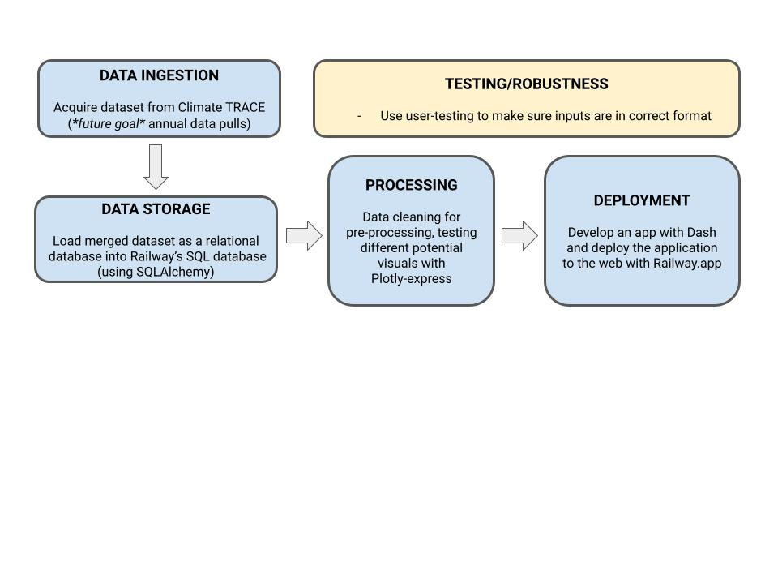

# GHG_Sources_App

--> NOTE: Work in progress - New data/app hosting platform is needed for deployment

### Abstract
While the general effects of greenhouse gases (GHG) on the earth’s atmosphere have been well-understood for decades, there is still a surprising dearth of information on the locations of the greatest GHG emissions throughout the world. With recent advancements in satellite and other remote-sensing detection of these sources, there is now the capability to better monitor and aggregate estimates of GHG emissions in every industry sector.  More public knowledge of locations of GHG emission sources across different sectors in each country will allow policymakers to better strategize how best to regulate abatement and incentivize the transition to alternatives. Closing this data gap will ultimately support both domestic policymaking and negotiations in international relations towards reducing GHG emissions.

### Design
The Climate TRACE consortium of research organizations have consolidated data on locations of emissions from varying industries.  The objective here is to develop a data visualization tool to allow the client, [Climate TRACE](https://climatetrace.org) , to see where certain sectors have different ranges of emissions for particular types of GHGs. A web app that includes a map and plotted emission source locations, will include different colored plotted points to represent industry sectors. Given the tens of thousands of points on a world map, options to filter for different industry sectors and GHG types will allow for easier visualization, along with a slider to set the range of emission values. 

### Data
The data was downloaded from the [Climate TRACE website](https://climatetrace.org/downloads) from five sectors. Several preprocessing steps were completed, including removing unnecessary entries of emission estimates (i.e., 20-year estimates and 100-year estimates). Monthly entries were summed to yearly counts where needed. Emission counts were log-transformed with base 10. Finally, all sectors were merged into a single data frame. After conducting the initial exploratory data analysis for annual emission sources, it was noted that the largest abundance of sources were recorded for the year 2021. Therefore, only data from 2021 was used for the application. Each row entry represents a unique emission source for a particular GHG. A total of 40,755 emission source/gas pair entries are included in this dataset.

### Tools
glob - import multiple .csv 
Pandas/Numpy - data manipulation
Datetime - timeseries data manipulation
SQLalchemy, PyMySQL, os - upload/communication with SQL on Railway 
Plotly - graphics (Plotly express used to test plausible visualizations)
Dash - app building platform 
Railway.app - housing SQL database and app deployment

### Data Engineering Pipeline

